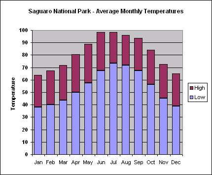

```{r setup, include=FALSE}
knitr::opts_chunk$set(echo = TRUE)
```

## Introduction & Data

Growing up in Appalachia is a privilege that few get to experience. Living with one of the greatest national parks in your backyard fosters a lifelong love of the outdoors and an appreciation for nature. Thanks to many great men before us, the greatest natural treasures of the US are preserved for all to enjoy in the form of national parks. Created in 1916, the National Park Service protects and maintains our national parks. They also hold records on how many visitors come to each park. 

In this post, I will use monthly recreational visitation data from 2003-2017 to cluster 58 national parks. Given the vast differences in landscapes across the US, I suspect that distinct clusters will be identified based on seasonal patterns and overall trend. Below I provide the source of the data used and a brief description of packages used to facilitate the analysis.

Data source: https://irma.nps.gov/Stats/

pacman - easy installation/loading of packages

tidyverse - data manipulation toolkit

TSrepr - time series dimension reduction package

ggplot2 - data visualization toolkit

reshape2 - easily reshape dataframes


```{r Introduction, echo = F, message = F}
if(!require(pacman)) install.packages('pacman')
p_load(tidyverse)
p_load(TSrepr)
p_load(ggplot2)
p_load(reshape2)
data <- read_csv('natpark.csv')

natpark <- data %>%
  rename_all(tolower) %>%
  select(-unitcode) %>% #remove unused variable
  mutate(parktype = as.factor(parktype), region = as.factor(region), state = as.factor(state)) %>%
  filter(parktype == 'National Park') %>% #Let's only consider national parks for now
  complete(parkname, year, month)  #Make sure every series has a row for all year/month combinations

#Remove incomplete cases
natpark <- natpark %>% filter(!parkname %in% pull(natpark[!complete.cases(natpark), 'parkname']))
#Make Trend
natpark$trend <- rep(1:180, 58)

#Count of unique parks
length(unique(natpark$parkname)) #unique parks

#Summarize
summary(natpark)

```

## First Approach: Mean Seasonal Profile 

The first approach at clustering will be through dimension reduction & clustering on those dimensions. Time series never fails to represent the curse of dimensionality. With 58 series of 180 observations each, the size of the data can be a problem of its own. Thus, reducing the series to more manageable dimensions can make analysis much simpler. For reducing the series, I will use the package TSrepr (a great write up by the author highlighting this approach in action is provided here: https://petolau.github.io/TSrepr-clustering-time-series-representations/). The data must be in a matrix format, with rows indicating a unique series. Then, we will reduce dimensions by finding the mean seasonal profile for each series, and use kmeans clustering to group the series. To find an ideal number of clusters, we will use the screeplot to find a reasonable number of clusters to minimize SSE within a cluster.

```{r TSrepr MSP, echo=FALSE}
#Get matrix
parkspread <- natpark %>% select(parkname, trend, recreationvisits) %>% spread(key = trend, value = recreationvisits) %>% select(-parkname)

#Get row names
parknames <- natpark %>% select(parkname, trend, recreationvisits) %>% spread(key = trend, value = recreationvisits) %>% select(parkname)

#Reduce dimensions with mean seasonal profile
msp <- repr_matrix(as.matrix(parkspread), func = repr_seas_profile, args = list(freq = 12, func = mean), normalise = T, func_norm = norm_z)

#Find ideal number of clusters
SSEs <- rep(NA,10)
for(k in 1:10){
  fit <- kmeans(msp,k)
  SSEs[k] <- fit$tot.withinss
}
plot(1:10,SSEs,type="b",xlab="Number of Clusters")

```

The screeplot suggests 6 could be a good number of clusters. Let's visualize the clusters. Note that the y-axis is normalized using z-score normalization

``` {r MSP Clusters}
set.seed(2112)
kfit <- kmeans(msp, 6)
kparks <- tibble(parkname = pull(parknames), cluster = kfit$cluster)
parkclust <- cbind(kparks, msp)
parkclust <- reshape2::melt(parkclust,id = c('parkname','cluster'), variable.name = 'month', value.name = 'visits')

#Plot seasonal profiles across clusters
ggplot(parkclust, aes(x = month, y = visits, group = parkname)) + facet_wrap(~cluster) + geom_line(color = "grey10", alpha = 0.65) + geom_smooth(aes(group = cluster), color = 'red')

```

Not bad! The clusters clearly have similar seasonal patterns. Cluster 2 looks like it could be a "catch-all" for poor fitting series, and cluster 1 is clearly parks that tend to peak in colder months. Let's try to visualize the overall trend. We will use min-max scaling for the overall trend

```{r Overall Trend}
#Plot overall series across clusters
natpark <- natpark %>% left_join(kparks)

ggplot(natpark, aes(x = trend, y = norm_min_max(recreationvisits), group = parkname)) + facet_wrap(~cluster) + geom_line(color = 'grey10', alpha = 0.65) + geom_smooth(aes(group = cluster), color = 'red')
```

We can still see the overlapping seasonal patterns, but it clearly doesn't consider the magnitude of the visits and only considers seasonality. This would be a useful way to help allocate resources across different seasons, but wouldn't tell much about how many visitors to actually expect. 

## Second Approach: FeaClip 

Let's try another technique: FeaClip. This method uses windowed feature extraction and has the benefit of not requiring normalization. Below we will follow the same methodology: identify an appropriate number of clusters and visualize. Using 10 clusters seems reasonable here.

```{r FeaClip clustering}
fclip <- repr_matrix(as.matrix(parkspread), func = repr_feaclip, windowing = TRUE, win_size = 12)

SSEs <- rep(NA,20)
for(k in 2:20){
  fit <- kmeans(fclip,k)
  SSEs[k] <- fit$tot.withinss
}
plot(1:20,SSEs,type="b",xlab="Number of Clusters")

set.seed(2112)
kfit <- kmeans(fclip, 10)
kparks <- tibble(parkname = pull(parknames), cluster = kfit$cluster)
parkclust <- cbind(kparks, msp)
parkclust <- reshape2::melt(parkclust,id = c('parkname','cluster'), variable.name = 'month', value.name = 'visits')

#Plot seasonal profiles across clusters
ggplot(parkclust, aes(x = month, y = visits, group = parkname)) + facet_wrap(~cluster) + geom_line(color = "grey10", alpha = 0.65) + geom_smooth(aes(group = cluster), color = 'red')

#Plot overall series across clusters
natpark$cluster <- NULL
natpark <- natpark %>% left_join(kparks)
natpark$cluster <- as.factor(natpark$cluster)
summary(natpark$cluster)/180

ggplot(natpark, aes(x = trend, y = norm_min_max(recreationvisits), group = parkname)) + facet_wrap(~cluster) + geom_line(color = 'grey10', alpha = 0.65)
```

What can we take away from this method compared to the mean seasonal profile? We see several sparse clusters: 1, 2, and 9 all have only a single park, while 10 has 2 parks. Looking at the overall trend, it's still hard to take away much, but we see that the magnitude of series is taken into consideration. We no longer see clusters with widely different magnitudes. Seasonally, we still see a separation between summer- and winter-peaking parks, though each now has several clusters rather than 1 or 2. Let's dig into some of the sparse clusters below to see what parks are deserving of their own cluster:

```{r Sparse Clusters}
natpark %>% filter(cluster %in% c(1,2,9,10)) %>% select(parkname, cluster) %>% unique()

```

Let's break these down individually:

## Saguaro National Park: 

This is a park that obviously peaks in the winter. However, a little research provides an obvious explaination.



As this plot illustrates, the temperature in the summer frequently breaks 100 degrees in the summer, and the park's website even notes: "most people visit Saguaro National Park during the winter months of January, February and March. Then it doesn't pick up again until November when it is cool again." This park offers the true desert experience!

## Haleakala National Park:

Located in Maui, Hawaii, this park is limited only to those living on the island and tourists to the area. Given that a plane ticket to Hawaii is a lot more expensive than a roadtrip to a continental national park, this park likely has a unique demand pattern that's dependant upon the tourism schedule to the island. This park is famous for its mountainous peaks and terrific views.

## Kobuk Valley National Park:

At the top of the world in Northern Alaska, Kobuk Valley is one of, if not the most remote national parks in the US. Travel to the park is limited to charter air flights, as no roads connect to the park. Further, extreme colds make visiting the park outside the summer months almost impossible. Thus, this park has it's own demand pattern that matches almost no other park in the US. The park is known for its frozen sand dunes, offering the true desert experience minus the heat.

## Everglades National Park & Virgin Islands National Park

Two of the Southern-most national parks, these parks are characterized by two features. One is the notably hot summer months, which discourage many from visiting during this season. Second, is the wet and dry seasons. Dry seasons provide a less humid and rainy environment, making it easier to enjoy the beauty of the parks. It doesn't help that the wet season overlaps with the hottest months, creating an unbearable humidity. The Everglades offer an interesting combination of forests and swamps, while the Virgin Islands offer clear waters & beautiful coral reefs.

## Conclusion

To sum up, we successfully clustered time series using dimension reduction & traditional clustering techniques. While other techniques exist (check out Dynamic Time Warping, which probably has the coolest name of any statistical technique you'll ever use), these methods work well with a large volume of data & help tackle the curse of dimensionality. 

Further, we saw that the US has a diverse offering of national parks to fit any preference of season and weather. From scorching deserts to frozen sand dunes, there's a place out there for everybody. As Teddy Roosevelt said: "There are no words that can tell the hidden spirit of the wilderness, that can reveal its mystery, its melancholy, and its charm". Get out and explore!